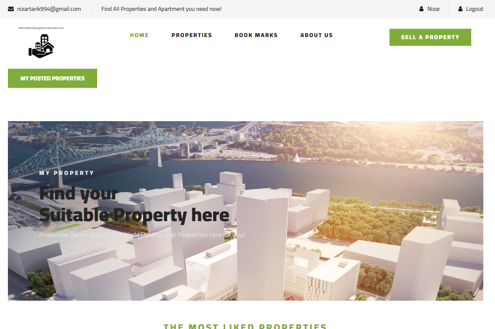
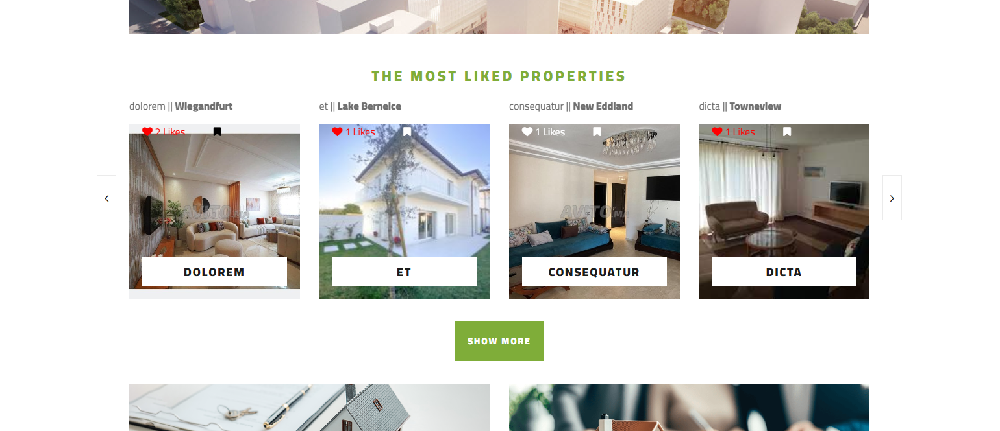
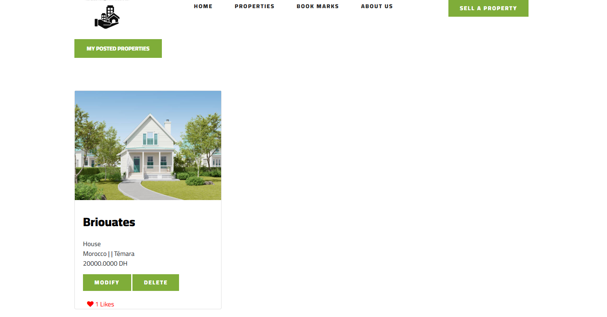

# 🏠 MyProperty

A website for users to buy and sell their houses.

---

## 📄 Description

Users can:

- 🔍 Browse and filter property listings  
- 📝 View detailed information about each property  
- 📞 Contact property owners via their displayed contact details  

By creating an account, users gain access to additional features:

- 👍 Like and bookmark listings  
- 🏡 Post their own properties for sale  
- 🧑‍💼 Become verified sellers  

---

## 🚀 How to Run the Project Locally

🛠 1. Install Dependencies
        
    composer install

    npm install
🔐 2. Generate Application Key

    php artisan key:generate
     
🧬 3. Run Migrations
        
    php artisan migrate
   
4. Seed the Database

        php artisan db:seed
    
🎨 5. Build Frontend Assets

    npm run dev
    npm run build
▶️ 6. Serve the Application

    php artisan serve

